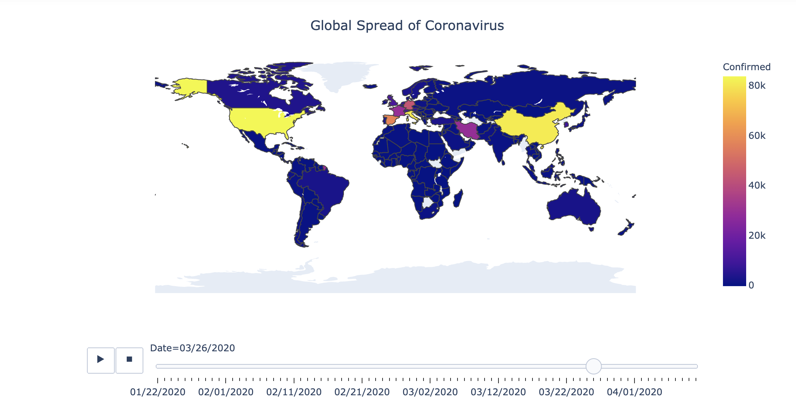

# Covid19 Choropleth Map

A python jupyter notebook that uses Novel Corona Virus 2019 dataset and create and animated choropleth map.

#### Resources
* [Novel Corona Virus 2019 Dataset](https://www.kaggle.com/sudalairajkumar/novel-corona-virus-2019-dataset)

